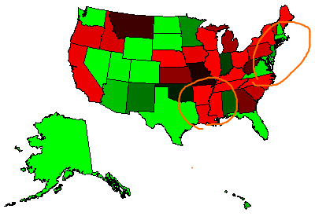

Best and Worst States to be a Taxpayer Debunked
========================================================

When I saw this [CNBC post on Google+](https://plus.google.com/109511956491697549112/posts/AWQpUEzimrp), my “bogus data analysis” radar started sending high alerts.

<iframe src="http://d2e70e9yced57e.cloudfront.net/common/wallethub/best-worst-states-to-be-a-taxpayer.html" width="556" height="347" frameBorder="0" scrolling="no"></iframe>

This is what they did: [WalletHub](http://wallethub.com/edu/best-worst-states-to-be-a-taxpayer/2416/) used average tax amount to rank state, adjusted to the cost of living index.

What’s wrong with that?
-----------------------

Well, I happen to think that the tax amount is correlated more directly to income, rather than the cost of living. There is nothing noteworthy to see someone pay higher tax if that person also have higher income.

In order to understand the true picture, you actually need to think in terms of tax to income ratio. So here is my counter analysis.

You can see that Massachusetts, where I live, actually looks pretty good, along with Mid-Atlantic region in my analysis while they were in red in the original map. On the other hand, the color completely flips in the opposite way in some Gulf Coast states in the Souhtb.

If you believed in the original analysis and moved from Massachusetts to one of those states, then your tax may go down, but that’ probably because your income goes down even more.

Simple analysis with MATLAB
---------------------------
All I had to do was download the median income dataset from Census Bureau website and merge two datasets. It was pretty easy with newly introduced _table_ data type.

### Import data
Using MATLAB R2013b

data sources

* http://wallethub.com/edu/best-worst-states-to-be-a-taxpayer/2416/
* http://www.census.gov/hhes/www/income/data/statemedian/

<pre><code>
% clear the workspace, close all figures and clear the command window
clearvars; close all; clc

% load data from files into tables
Tax = readtable('bestWostStateTax.csv');
Income = readtable('medianincome.csv');

% Join tables
T = join(Tax(:,2:3),Income);
% Rename columns
T.Properties.VariableNames = {'State','Tax','Income','SDev'};

% Compute Tax to Income Ratio
T.TaxToIncome = T.Tax./T.Income;
% Get the ranking based on TaxToIncome
T2 = sortrows(T,{'TaxToIncome'});
</code></pre>

### Compare ranking before and after

<pre><code>
disp('By Avg. Tax               By Avg. Tax Rate')
disp([T.State T2.State])

% Averages
muTax=mean(T.Tax);
muTaxToIncome= mean(T2.TaxToIncome);

% Which states are below average
belowAvgTax = T.State(T.Tax < muTax);
belowAvgRate = T2.State(T2.TaxToIncome < muTaxToIncome);

% Top 20
disp('Top20')
disp('By Avg. Tax        By Avg. Tax Rate')
disp([belowAvgTax(1:20) belowAvgRate(1:20)])
</code></pre>

> By Avg. Tax               By Avg. Tax Rate
>
>     'Wyoming'                 'Wyoming'             
>     'Alaska'                  'Alaska'              
>     'Nevada'                  'Washington'          
>     'Florida'                 'Nevada'              
>     'South Dakota'            'South Dakota'        
>     'Washington'              'Florida'             
>     'Texas'                   'Colorado'            
>     'Delaware'                'Texas'               
>     'North Dakota'            'North Dakota'        
>     'Colorado'                'Utah'                
>     'New Mexico'              'Delaware'            
>     'Alabama'                 'Massachusetts'       
>     'Arizona'                 'New Hampshire'       
>     'Utah'                    'Virginia'            
>     'Mississippi'             'Maryland'            
>     'Indiana'                 'District of Columbia'
>     'Louisiana'               'Rhode Island'        
>     'West Virginia'           'Arizona'             
>     'Montana'                 'Hawaii'              
>     'Oklahoma'                'New Jersey'          
>     'Massachusetts'           'Minnesota'           
>     'Rhode Island'            'New Mexico'          
>     'South Carolina'          'Alabama'             
>     'Missouri'                'Indiana'             
>     'Tennessee'               'Oklahoma'            
>     'Georgia'                 'Connecticut'         
>     'Virginia'                'Missouri'            
>     'New Hampshire'           'Montana'             
>     'Hawaii'                  'West Virginia'       
>     'Kentucky'                'Georgia'             
>     'Arkansas'                'Kansas'              
>     'Ohio'                    'Michigan'            
>     'Kansas'                  'Vermont'             
>     'Idaho'                   'South Carolina'      
>     'North Carolina'          'Pennsylvania'        
>     'Michigan'                'Idaho'               
>     'District of Columbia'    'Oregon'              
>     'Minnesota'               'Iowa'                
>     'Pennsylvania'            'California'          
>     'Oregon'                  'Louisiana'           
>     'Maryland'                'Tennessee'           
>     'Maine'                   'Wisconsin'           
>     'Iowa'                    'Mississippi'         
>     'New Jersey'              'Ohio'                
>     'Vermont'                 'Illinois'            
>     'Wisconsin'               'Maine'               
>     'Illinois'                'Nebraska'            
>     'Connecticut'             'Kentucky'            
>     'Nebraska'                'North Carolina'      
>     'California'              'Arkansas'            
>     'New York'                'New York'            
> 
> Top20
> 
> By Avg. Tax        By Avg. Tax Rate
> 
>     'Wyoming'          'Wyoming'             
>     'Alaska'           'Alaska'              
>     'Nevada'           'Washington'          
>     'Florida'          'Nevada'              
>     'South Dakota'     'South Dakota'        
>     'Washington'       'Florida'             
>     'Texas'            'Colorado'            
>     'Delaware'         'Texas'               
>     'North Dakota'     'North Dakota'        
>     'Colorado'         'Utah'                
>     'New Mexico'       'Delaware'            
>     'Alabama'          'Massachusetts'       
>     'Arizona'          'New Hampshire'       
>     'Utah'             'Virginia'            
>     'Mississippi'      'Maryland'            
>     'Indiana'          'District of Columbia'
>     'Louisiana'        'Rhode Island'        
>     'West Virginia'    'Arizona'             
>     'Montana'          'Hawaii'              
>     'Oklahoma'         'New Jersey' 

### Prepare a map
<pre><code>
states = shaperead('usastatelo', 'UseGeoCoords', true);
names = {states.Name};
ranking = zeros(length(names),1);
for i=1:length(names)
    ranking(i)=find(strcmpi(names(i),T2.State));
end
colors = redgreencmap(length(ranking));
stateColors = colors(ranking,:);
indexHawaii = strcmp('Hawaii',names);
indexAlaska = strcmp('Alaska',names);
indexConus = 1:numel(states);
indexConus(indexHawaii|indexAlaska) = [];
</code></pre>

### Plot a map

<pre><code>
figure; ax = usamap('all');
set(ax, 'Visible', 'off')
for j = 1:length(indexConus)
    geoshow(ax(1), states(indexConus(j)),'FaceColor',stateColors(indexConus(j),:))
end
geoshow(ax(2), states(indexAlaska),'FaceColor',stateColors(indexAlaska,:))
geoshow(ax(3), states(indexHawaii),'FaceColor',stateColors(indexHawaii,:))
for k = 1:3
    setm(ax(k), 'Frame', 'off', 'Grid', 'off',...
      'ParallelLabel', 'off', 'MeridianLabel', 'off')
end
colormap(colors)
colorbar
</code></pre>